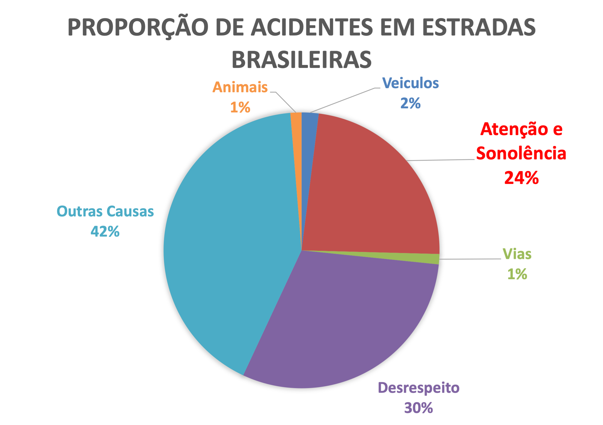
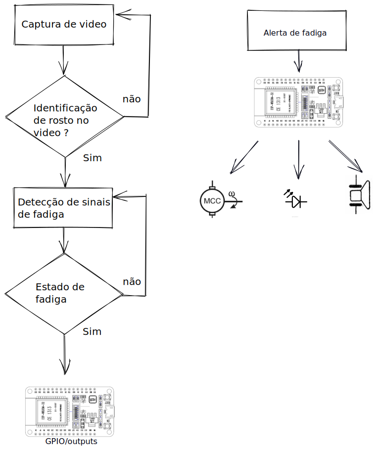
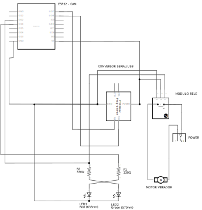
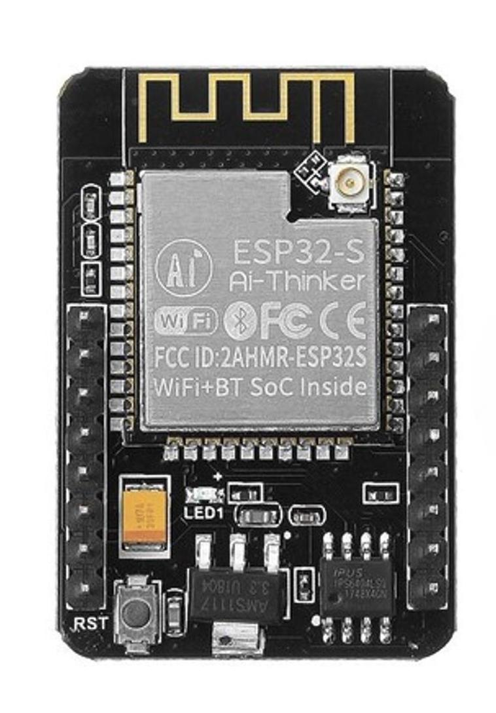
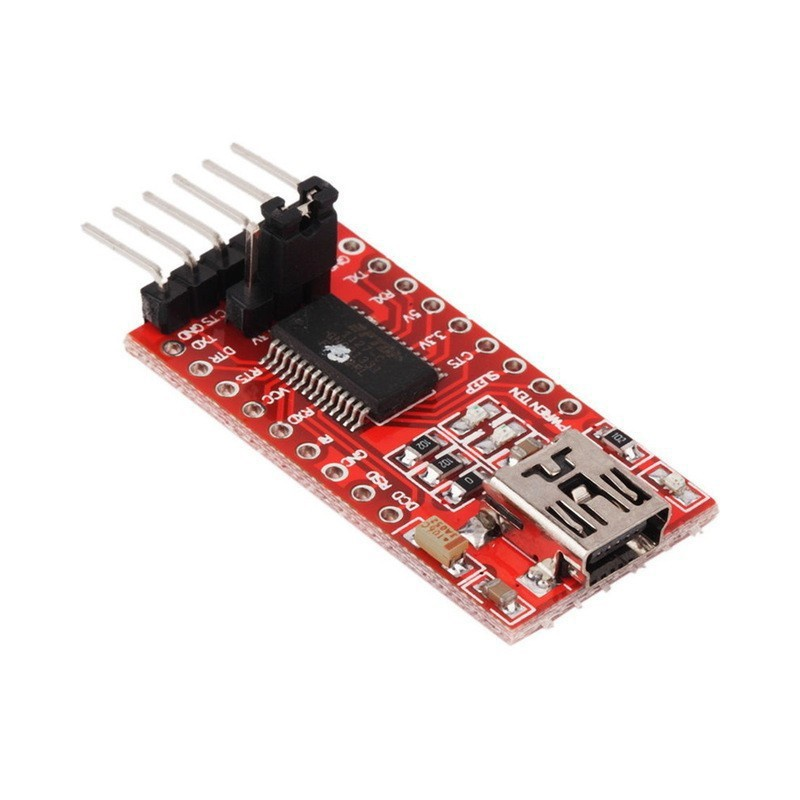
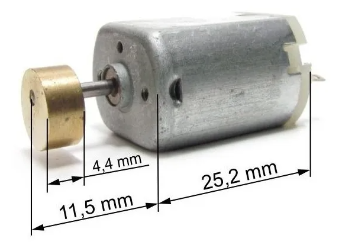
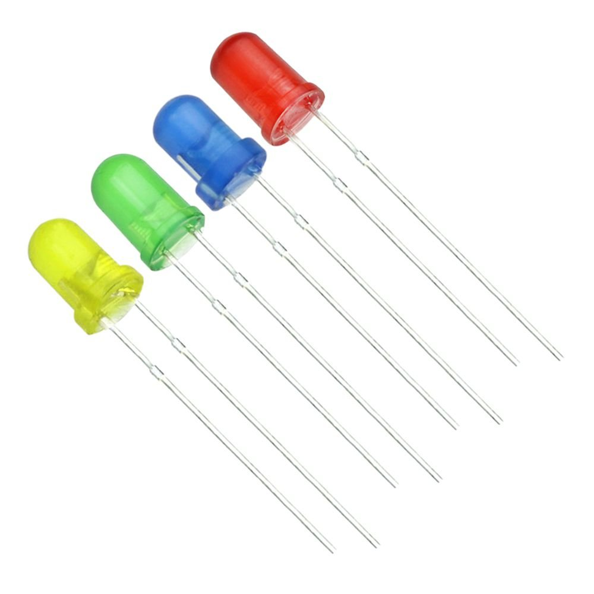
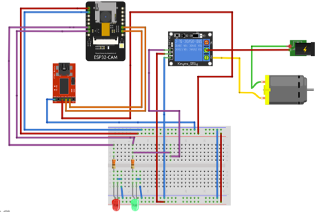
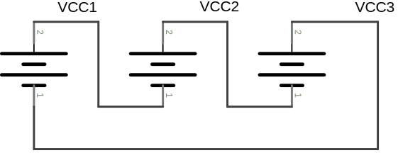

PROJETO EM DESENVOLVIMENTO ! 
ABERTO PARA AJUDA!!
==============================================
Todos os dias, vemos um número significativo de motoristas se envolvendo em acidentes nas cidades por diversos problemas, dentre eles os relacionados à fadiga. Com essa observância, é válido desenvolver técnicas e sistemas que controlem o número crescente desse tipo de acidente. A Visão Computacional permite a análise de imagens para a extração de informações e, que, com essas informações após filtradas, tratadas e direcionadas pode-se desenvolver ações baseadas nestes aspectos visuais com relação a um motorista objetivando prevenir possíveis problemas associados. Levando isso em consideração, este trabalho estudou técnicas de detecção de olhos, para identificar se os olhos estão abertos ou fechados, indicativos do que pode representar sinais de fadiga ou sonolência. Os algoritmos foram feitos em linguagem de programação Python utilizando como principal a biblioteca OpenCV Este trabalho faz a análise dos resultados alcançados para viabilizar a aplicação deste sistema em equipamentos e veículos necessários.
 
considera-se sinais de fadiga :
Olhos fechados por mais de 2 segundos
Olhos entre abertos por mais de 2 segundos

considera-se sinais de atenção e sinais naturais :
Olhos abertos
Olhos voltados para frente

==============================================

 Motivação : 
 Dados do ministério de infraestrutura brasileiro , apresentam que cerca de 24% dos acidentes são gerados por sono, fadiga ou falta de ateção na direção.
 

# tecnologias utilizadas

 
<strong> 👨‍ O que você vai usar? <strong>

  ✨Python 3.10.8
  OpenCV 4.6.0.66
  Dlib 19.24.0
  imutils 0.5.4
  face-recognition 1.3.0
  face-utils 0.1.0
  notify-run 0.0.15
  scipy 1.9.3
 

 # Instalação das bibliotecas com python 3 :
  
  

    
<strong> 👨‍ Bibliotecas e instalação <strong>

  command : 
 
       > pip3 install imutils opencv-python dlib multiprocessing scipy notify-run playsound

   ⚠ Atenção ⚠ Caso o comando acima não instale alguma das bibliotecas necessarias, faça a instalação previa da lib cmake com o comando :
      
       > pip3 install cmake 
 

# DESENVOLVIMENTO
Esse projeto foi desenvolvido parte de hardware intergrada ao software de forma a responder com sinais fisicos com um sistema embarcado utilizando a placa esp32-cam.

O funcionamento segue a estrutura do diagrama de blocos da figura 2:

Utilizaremos o circuito conforme figura 3 para criar a plataforma fisíca para controle de estado de fadiga. 

 # Componentes eletrônicos utilizados
 
 

   
<strong> 👨‍ Eletrônica <strong>

 🍪Esp32-cam :
 
 
 🍪Conversor FTDI serial/usb RS232 :
  
 
 🍪Motor Ak280 12VDC 89ma :
  

 🍪Bateria 3150mAh 3,6V :
  

 🍪Led 5mm 2V :
  

 🍪Modulo rele 5VDC 1 canal :
 

 

 
 # Montagem
 
 

   
<strong> 👨‍ Circuito <strong>

  

 

 # Alimentação esp32-cam

 

   
<strong> 👨‍ Placa esp32-cam <strong>

   A alimentação da placa esp32-cam pode ser feita pelo conector serial do conversor FTDI conectando os pinos 5v e GND do conversor aos pinos 5v e GND da placa esp32-cam.

   Pode-se utilizar fontes de 5v com até 0,6A ou entradas USB 2.0 ou 3.0 para alimentação.

 

 # alimentação do motor 

  

   
<strong> 👨‍ Banco de baterias <strong>

   A alimentação do motor usado no projeto deve ser externa, pois o esp32-cam não trabalha com tensão nominal de 12v, utilizada pelo motor. 
   Vamos realizar a ligação em serie de 3 baterias de 3.6v e 3150mAh ( utilize a que melhor lhe atender ) ;
   
   Na ligação em serie de baterias , a tensão nominal das baterias é somada e a corrente se mantem a mesma em todo o circuito , neste caso teremos 10.8v e 3150mAh para alimentação do motor.
  
  ⚠ Atenção ⚠ Consultar a ligação das baterias no circuito mostrado anteriormente.

  

 

